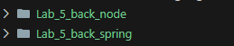

# Informe: Laboratorio 5 - BACK

- Jared Sebastian Farfan Guevara.

- [Front](https://github.com/Jared-Farfan/Lab_5_FRONT_ARSW_2026-1)

---

## Descripción general

Se crearon dos diferentes backend para la creacion de un canvas interactido permitiendo diferentes usuarios estar conectado.
el primer backend para usar p5 en el front con spring en backend y un segundo backend para el uso de socket.io con node.

---

## Ejecucion

### Spring

- En la terminal ejecutar  `cd Lab_5_back_spring`, `mvn clean install` y `.\mvnw spring-boot:run`
- Ejecuta el [Front](https://github.com/Jared-Farfan/Lab_5_FRONT_ARSW_2026-1) 
- Verifica que en el arichivo main.jsx estes usando el `P5`
- Ejecutar front `npm i`,  `npm run dev`

### Node

- En la terminal ejecutar  `cd Lab_5_back_node`, `npm i` y `npm run start`
- Ejecuta el [Front](https://github.com/Jared-Farfan/Lab_5_FRONT_ARSW_2026-1) 
- Verifica que en el arichivo main.jsx estes usando el `App`
- Ejecutar front `npm i`,  `npm run dev`